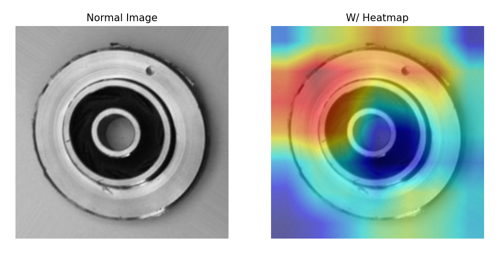

# Metal Casting Defect Detection
This is a personal machine learning project that fine-tune Convolutional Neural Network (CNN) to automate quality control. This model is trained to inspect images of metal castings and accurately detect and label defects.

**Dataset** [Metal Casting Dataset on Kaggle](https://www.kaggle.com/datasets/ravirajsinh45/real-life-industrial-dataset-of-casting-product)

## Project Structure
This project is organized into sequantial scripts:
* **`1_training.py`** - Trains the model using pre-trained **ResNet18**, specializing into detecting defects on metal casting.
* **`2_predict_single.py`** - Using trained model on one images of the defected metal casting.
* **`3_predict_test.py`** - Runs model testing on testing data and display the performance/accuracy of the model.
* **`4_explain.py`** - Using Grad_CAM to generate heatmap, justifying the model's prediction by highlighting parts of the image the model used for prediction.
* **`5_web_app.py`** - Simple **Streamlit** web application that allows user to test the model to see the predictions and heatmap.

---

## Conclusion
### Model Accuracy
The `3_predict_test.py` confirms the model is highly effective. Scoring of 99.3% accuracy, correctly predict 710 images out of 715.

### Justification on Accuracy
The `4_explain.py` uses Grad_CAM to generate heatmap highlight the parts of the image the model uses for prediction. The resulting heatmap confirms the model correctly focuses on defects such as cracks or malformed egdes indicated by the orange-red regions.

## Running this project
You can test the model by viewing the [Streamlit website]() or run the model on your personal computer following these steps:

**1. Clone the repository and navigate to the directory.**
    git clone [https://github.com/LikeLightS/CNN](https://github.com/LikeLightS/CNN)

**2. Create vitual environment using `uv` and install required dependencies.**
    pip install uv
    uv venv
    uv pip install -r requirements.txt

**3. Run Streamlit Web App**
    streamlit run 5_web_app.py